# Guide for beginners  

Hello there!   
I know where you're here. So, let's get straight to the subject!  

::: tip Things you need to know!
* Matject is a script to make using shaders on Minecraft: Bedrock Edition much easier.
* **Absolutely zero** Command Prompt/Terminal knowledge is needed to use it!  
All you have to do is press some keys to navigate.  
* It automatically takes care of many things.  
So, don't worry, just give it shader you want to use and it will work.
* It's 100% safe.  
> You can know more about Matject on this documentation. Just explore!
:::

  

# So, what should I do now?
**Check requirements**  
* Install **[IObit Unlocker](https://www.iobit.com/en/iobit-unlocker.php)**
* Make sure you haven't modified Minecraft `material.bin` files before.  
If you don't know what it means then most probably you haven't modified anything. So, don't worry.
* Make sure you have **PowerShell** on your PC. (Most Windows PCs have PowerShell built-in)
::: details How to check if you have PowerShell?
By searching `powershell` in start menu.  

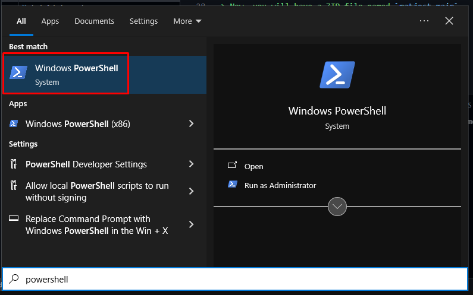  

::: details What if I don't have it?
Check this [guide](https://www.makeuseof.com/windows-cannot-find-powershell-fix/) to get PowerShell on your PC.
:::
* Know basic English

 
 

## Download and setup
1. Get Matject from [here](https://github.com/faizul726/matject/archive/refs/heads/main.zip) if you haven't already.  

2. Now, you should have a file named `matject-main.zip`. Extract it.  

 

  

3. Go to the extracted folder named `matject-main` and open `matject`  

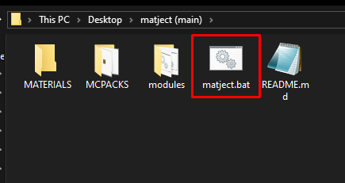  

  

>   
> If something like this shows up, click `Run` (Tip: Turn off "Always ask before opening this file" to avoid annoyance)

  

4. A window like this should show up,  

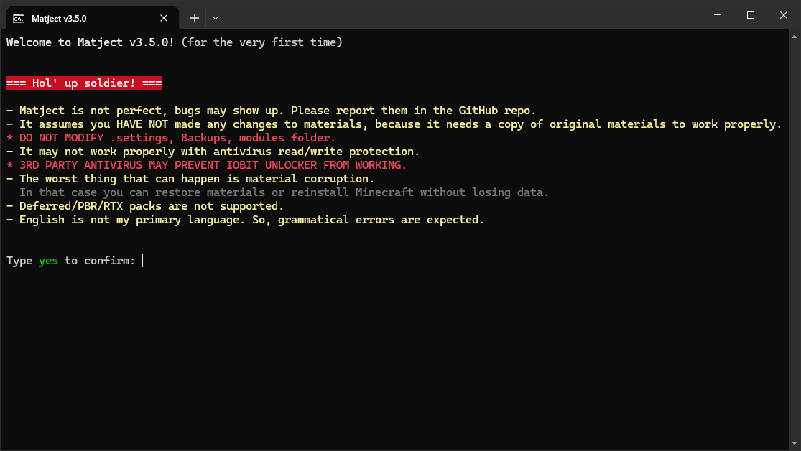  

Read it properly, write `yes` and press ENTER.  

  

5. (see below)

> 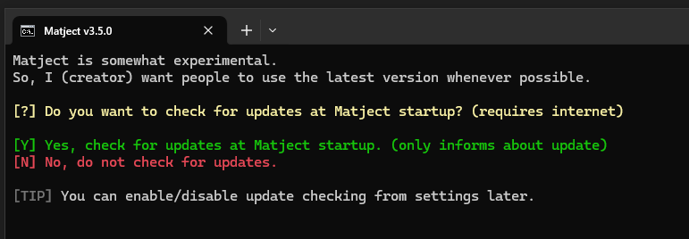
> 
> 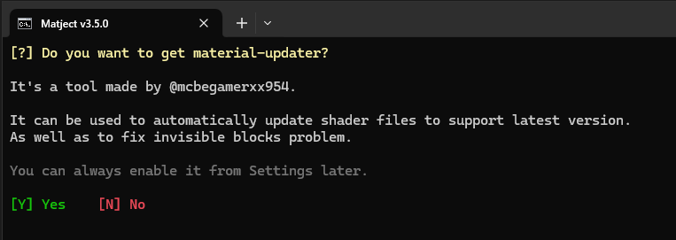  
> &nbsp;
> These are optional. You can Press [Y] for Yes or [N] for No to confirm your decision.  

  

6. If you are asked to Unlock WindowsApps like this...  

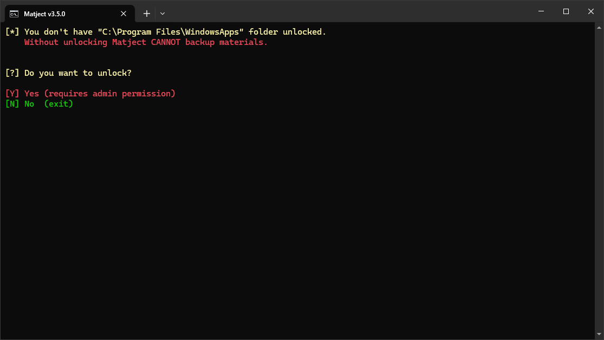  

Press [Y] to unlock WindowsApps folder. It will allow Matject to read content inside so that it can make backup.  

**Don't worry.** The folder doesn't contain any private information.  

  

7. Now if everything is okay, it will make a backup and bring you to a window like this,  

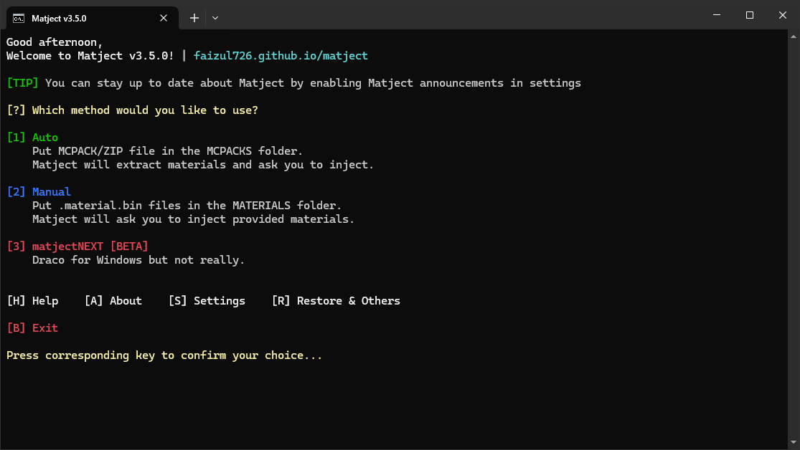 

  

## Applying a shader  

Congratulations on making it this far!  

Now, let me show you how to apply a shader...  

1. In the main screen, press [1] to use Auto method  

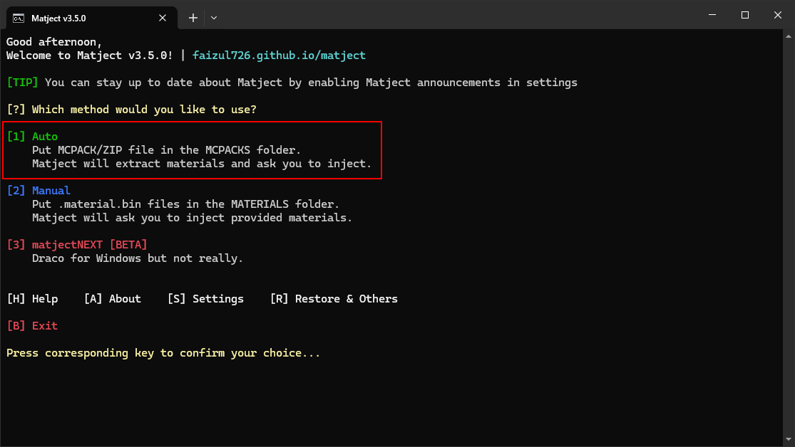  

  

2. Put the shader MCPACK or ZIP file in the `MCPACKS` folder  

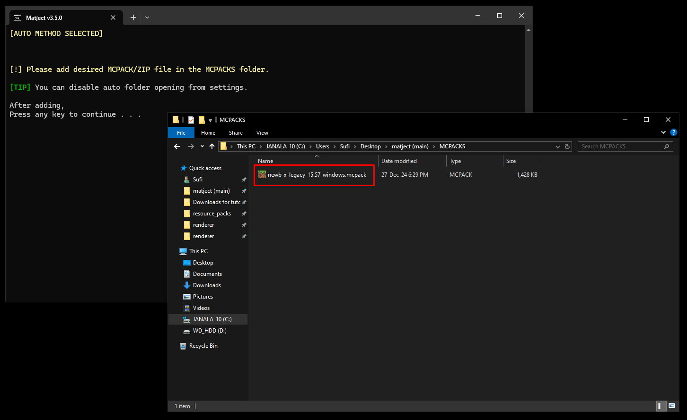  

::: details Can I put multiple MCPACK or ZIP files in the `MCPACKS` folder?  
Yes, you can put all your favorite shaders in the folder.  

For multiple files a list like this will show up,  

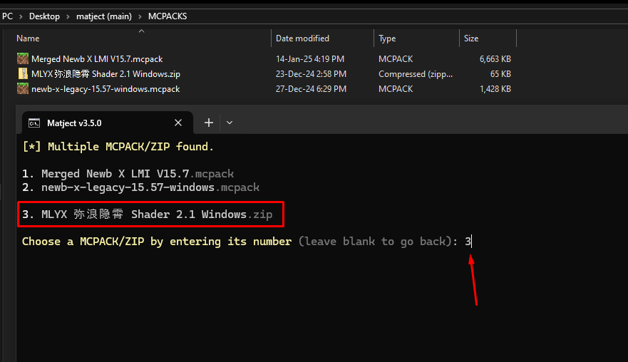  

You can write the number of the shader that you want to use and press ENTER.  

Here, I wrote 3 and pressing enter will pick the 3rd shader from list named MLYX...
:::

  

3. Confirm your selection by pressing [Y] or [N]  

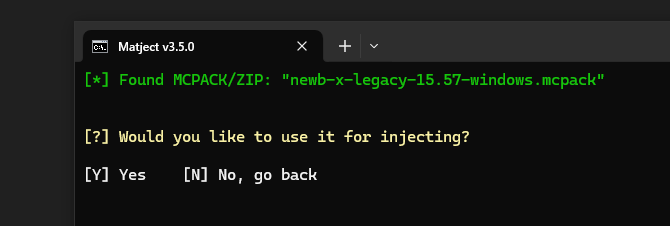  

  

4. If asked to choose a subpack, write its number and press ENTER.  

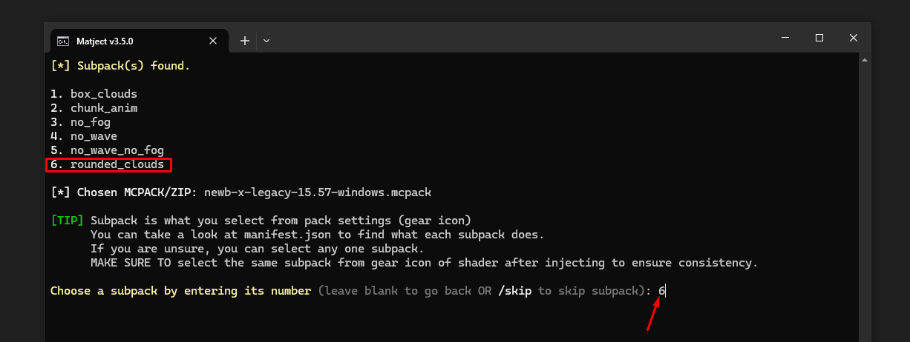  

Here, I wrote 6 and pressing enter will pick 6th subpack from the list named rounded_clouds  

::: details What is subpack?  
It's like settings for the shader. Many shaders come with options like these.  

::: details Keep in mind...
You also have to select the same subpack from resource packs settings later to make sure the shader works as expected.  
The names shown in the list and in resource packs settings may not be the same always. In that case, you can check manifest.json inside the provided file to get an idea of what each in the list do.  

  
  

&nbsp;

You can also write `/skip` and press **[ENTER]** and it will skip the subpack part  
(only if you know what you're doing + it may cause shader to not work as expected.)
:::

  

5. If everything was okay, a window like this will show up,  

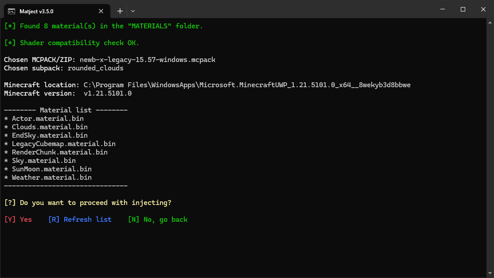  

Here, you can press [Y] or [N] to confirm injection (applying shader to Minecraft)  

  

6. Accept all admin permission requests.  

  
Based on the situation, it will ask you 2 or 4 times.  

    

## Congratulations!  
**You have applied a shader succesfully.**  

  

It's better to import the MCPACK and activate it if asked to do so.  

 

  
If you selected a subpack, make sure to activate the same subpack in settings (gear icon) of your shader in global resource packs.  

  

### [How to remove/uninstall shaders?](/docs/restoring-to-default)

  

## Screenshots

.png>)  
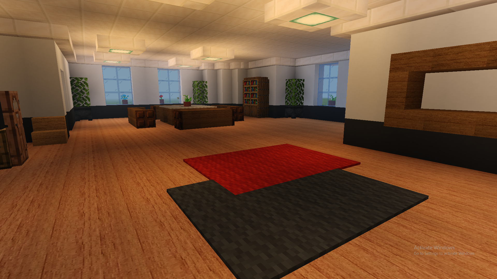  
.png>)  
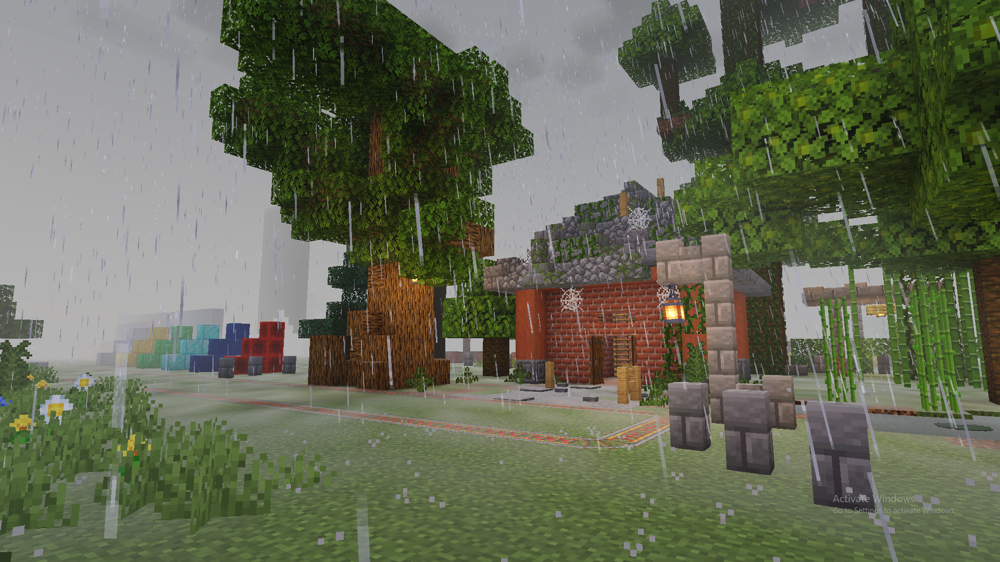

 

::: tip
If you're changing shaders, you don't have to restore manually.  
It will automatically restore files as needed.
:::  